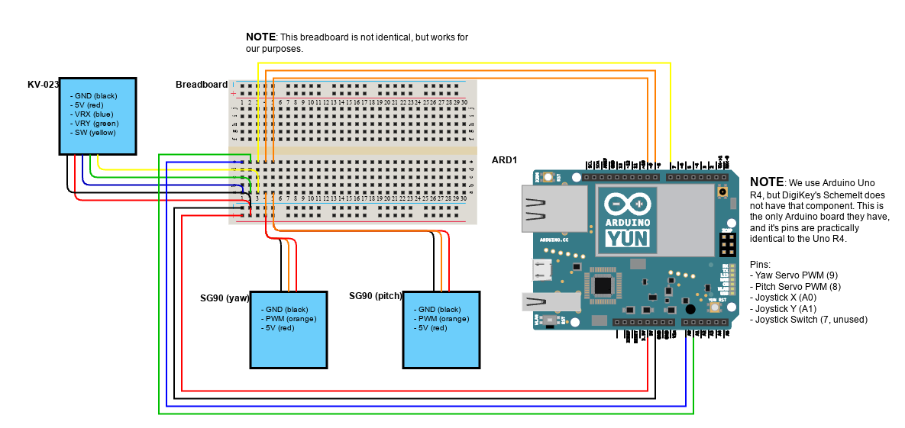

# ArduinoPanTiltMountPlugin

This plugin allows you to control a pan-tilt mount using an Arduino board. It provides an interface to send commands to the Arduino, which in turn controls the motors of the pan-tilt mount.

## Features

- Control pan and tilt angles
- Read current angles and bounds from mount

## Requirements

### Hardware

- Arduino board (e.g. Arduino Uno)
- USB cable for communication/power
- 2 servo motors for pan and tilt (e.g. SG90 micro servos)
- Pan-tilt mount frame (can be 3D printed or purchased)
- Jumpers and breadboard for connections
- Joystick module (optional, for manual control. e.g. KY-023)

### Software

The software that you use to program the Arduino can be custom, but needs to follow a specific protocol to communicate with the plugin. Below are the recommended tools:

- Arduino IDE
- `Servo.h` library (included with Arduino IDE)

#### Protocol Messages

- `info`
	- Description: Sent by the plugin to request mount information. The Arduino should respond with the current pan and tilt angles, as well as their bounds.
	- Response: `minYaw=#&maxYaw=#&minPitch=#&maxPitch=#&yaw=#&pitch=#\n`
- `#,#`
	- Description: Sent by the plugin/user to move the mount to a specific angle.
	- Parameters: `yaw` (pan angle), `pitch` (tilt angle)

## Example Setup

Below is an extremely basic setup used for testing. It could be simplified even more, but for clarity and transparency, this is what was used.

### Hardware

- Arduino Uno R4
- USB-C cable
- 2 SG90 micro servos
- KY-023 joystick module
- Pan-tilt mount frame ([Amazon](https://www.amazon.com/dp/B0775R6JFF))
- Breadboard

### Software

The source code for the Arduino can be found in the `Arduino` folder of this plugin. It is recommended to use Arduino IDE to build and upload. The steps to do so are as follows:

1. Open the `controlled_servos.ino` file in Arduino IDE.
2. Ensure that the `Servo.h` library is included (it should be by default).
3. Connect your Arduino board to your computer via USB.
4. Select the correct board and port in Arduino IDE.
5. Verify the sketch to check for any potential errors.
6. Upload the sketch to the Arduino board.